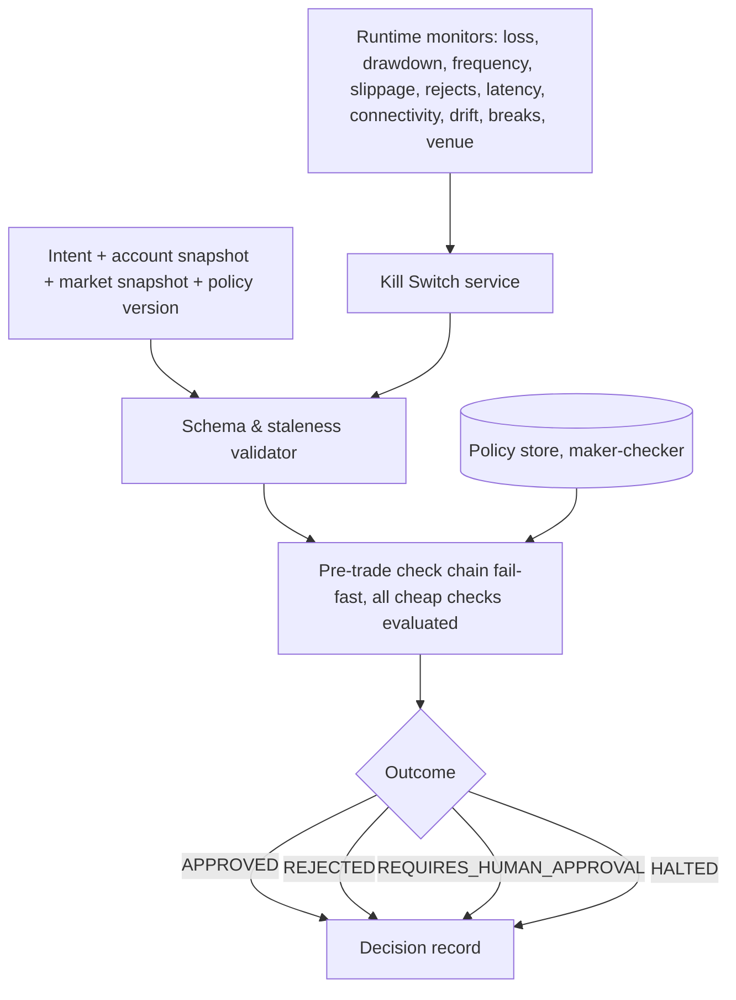

# COMPONENT_DIAGRAMS (C4 Level 3)

| Owner | Reviewer (different line) | Approving body | First gate | Status |
|---|---|---|---|---|
| Enterprise Architect | Backend Lead | ARB | B | Draft v1.0 |

## Risk Engine [Source: 05; Committee]

No I/O, randomness or model call inside the decision function; unavailability → HALTED.

## Execution Gateway [Source: 03; Committee]
```mermaid
flowchart LR
  CMD[Authorised order command] --> IDEM[Idempotency check: key = hash(intent_id, account, policy_version)]
  IDEM --> LEASE[Executor lease + fencing token per account]
  LEASE --> SUB[Broker submission with client-order-id derived from key]
  SUB --> ACK[Ack / reject / fill events → outbox]
  ACK --> AUD[(Audit)]
```

## MCP server sandbox [Source: 04]
Signed registry → allowlisted tools with scopes → short-lived identity → schema validation in/out → egress allowlist → quotas/timeouts/payload limits → tamper-evident logs → emergency revocation.
