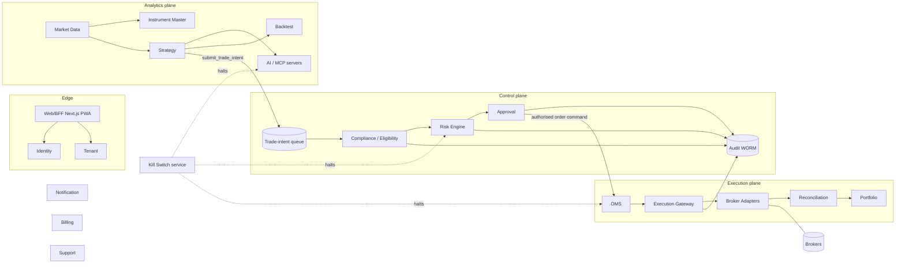

# CONTAINER_DIAGRAM (C4 Level 2)

| Owner | Reviewer (different line) | Approving body | First gate | Status |
|---|---|---|---|---|
| Enterprise Architect | Cloud Architect | ARB | B | Draft v1.0 |

Twenty bounded contexts [Source: 03] grouped into three planes [Committee].

Network policy: Analytics plane has no route to Execution plane or brokers; AI/MCP has no route to vault [Source: 04].

Stack [Source: 03]: Next.js/TypeScript PWA; FastAPI or typed service framework [Open: O-04]; PostgreSQL; time-series store [Open: O-13]; object storage (evidence); Redis (controlled cache); Kafka-compatible bus + schema registry; containers, IaC, mesh where justified, vault/HSM/KMS, WAF, SIEM, tracing, feature flags.
