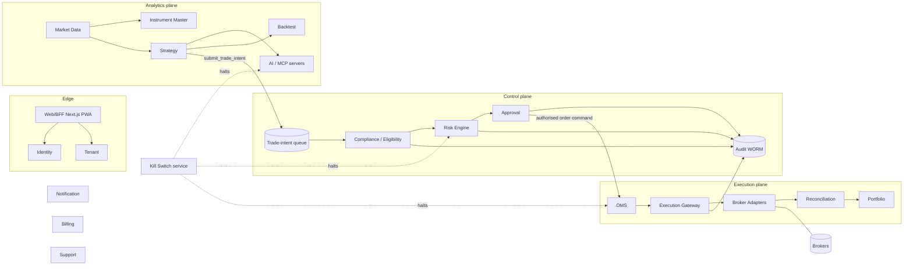

# CONTAINER_DIAGRAM (C4 Level 2)

| Owner | Reviewer (different line) | Approving body | First gate | Status |
|---|---|---|---|---|
| Enterprise Architect | Cloud Architect | ARB | B | Draft v1.1, 2026-09-08 — stack line corrected to D-055 / D-056 (ARB condition C-CM-6); Cloud Architect review **pending**; human Product Owner decision **pending** (D-039); not accepted |

Twenty bounded contexts [Source: 03] grouped into three planes [Committee].

Network policy: Analytics plane has no route to Execution plane or brokers; AI/MCP has no route to vault [Source: 04].

Stack [Source: 03]: Next.js/TypeScript PWA; FastAPI with Pydantic v2 strict models at the edges, engines framework-free and importable without the web stack (ADR-009 Accepted, D-055; the Execution-plane host language is re-decided at Gate C on measured baselines, never on a date — O-86); PostgreSQL; bitemporal market-data store = PostgreSQL per regional cell plus an object-storage archive in the same cell, with a dedicated time-series database only on a measured trigger (D-056; **ADR-004 still records the deferral — its rev.2 is owed by the Enterprise Architect**; no cost figure is decided, every CAPACITY_MODEL §Storage term stays [Open: O-87, O-88]); object storage (evidence); Redis (controlled cache); Kafka-compatible bus + schema registry (ADR-005; dev/sim carries events in process after the outbox write, no bus is deployed) [Open: R-05]; containers, IaC, mesh where justified, vault/HSM/KMS, WAF, SIEM, tracing, feature flags.

Nothing in that line is provisioned [Committee]: `infra/kubernetes` holds namespaces and network policies only and `infra/iac/README.md` says modules are added once the provider is chosen; a reader must not infer a deployed component from the stack line [Open: H-05, A-6, B-15].
