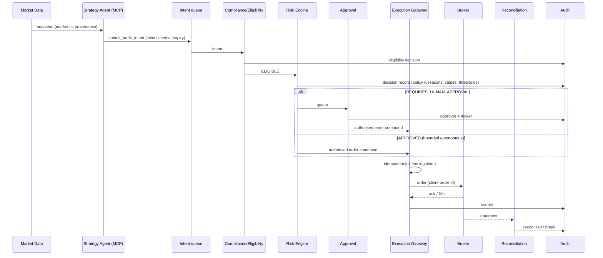

# SEQUENCE_DIAGRAMS

| Owner | Reviewer (different line) | Approving body | First gate | Status |
|---|---|---|---|---|
| Enterprise Architect / Trading Domain Lead | Chief Risk Agent | ARB | B | Draft v1.0 |

## S-01 Trade intent to fill (authoritative pipeline) [Source: 00]

## S-02 Kill Switch activation [Source: 05]
Operator or monitor → Kill Switch service → block new risk → cancel open orders → apply account emergency policy (CANCEL_ONLY default) → revoke agent tokens → evidence snapshot → notify → (later) two-person restore.

## S-03 Executor failover with in-flight order [Committee]
Standby acquires lease with new fencing token → any late submission with old token rejected by gateway → reconciliation confirms single broker order.
